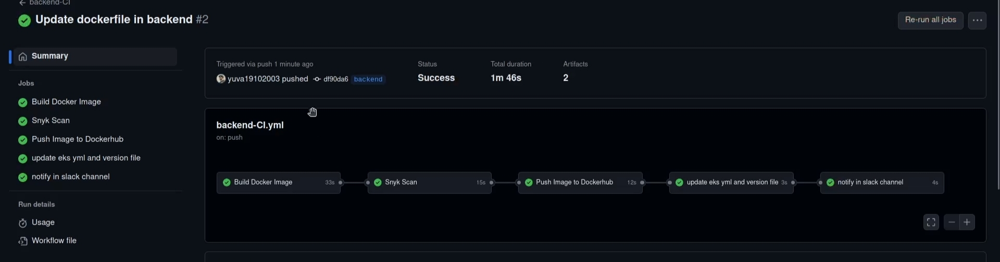

# DEVSECOPS PROJECT 
---
## DIAGRAM 


## APPLICATION 

### Random Anime Quote Generator

This repository contains a three-tier microservices application that generates random anime quotes. The application is composed of the following tiers:

- **Frontend**: Built with Golang and HTML
- **Backend**: Golang API using the Gin framework
- **Database**: MySQL

### Architecture

- **Frontend**: Serves the HTML page and handles user interactions.
- **Backend**: Provides API endpoints for fetching random quotes.
- **Database**: Stores the anime quotes.

### Technologies Used

<div style="text-align: center;">
  <a href="https://golang.org" target="_blank">
    
  </a>
  <a href="https://developer.mozilla.org/en-US/docs/Web/HTML" target="_blank">
    
  </a>
  <a href="https://www.mysql.com" target="_blank">
    
  </a>
  <a href="https://gin-gonic.com" target="_blank">
    
  </a>
</div>

## Getting Started

### Prerequisites

- [Golang](https://golang.org/dl/)
- [MySQL](https://www.mysql.com/downloads/)
- [Gin](https://github.com/gin-gonic/gin)

### Setting Up the Database

1. Install MySQL and start the MySQL service.
2. Create a database named `quotes`.
3. Create a table `anime_quotes` with the following schema:

```sql
USE anime_db;

CREATE TABLE quote (
    ID INT AUTO_INCREMENT PRIMARY KEY,
    Content VARCHAR(255)
);
```

### DIAGRAM 


4. Insert some quotes into the `anime_quotes` table:

```sql


INSERT INTO quote (Content) VALUES
('The world is cruel but also very beautiful — Attack on Titan'),
('Revenge is just the path you take to escape your suffering — Bleach'),
('Simplicity is the easiest path to true beauty - Seishuu Handa Barakamon'),
('A dropout will beat a genius through hard work - Rock Lee'),
('Knowing what it feels to be in pain, is exactly why we try to be kind to others - Jiraiya'),
('Hurt me with the truth. But never comfort me with a lie - Erza Scarlet'),
('Power comes in response to a need, not a desire. You have to create that need - Goku'),
('Being lonely is more painful than getting hurt - Monkey D. Luffy'),
('I refuse to let my fear control me anymore - Maka Albarn'),
('Life is not a game of luck. If you wanna win, work hard- Sora');
```

### Running the Backend

1. Navigate to the `backend` directory.
2. Install the required dependencies.
3. Start the backend server.

### Running the Frontend

1. Navigate to the `frontend` directory.
2. Create the necessary HTML templates.
3. Start the frontend server.

### Accessing the Application

Open your web browser and go to `http://localhost:8080` to access the Random Anime Quote Generator.

### Project Structure

```
.
├── backend
│   ├── main.go
│   ├── config.go
│   └── quotes.go
├── frontend
│   ├── main.go
│   └── templates
│       └── index.html
└── README.md
```

### Backend (Gin API)

- `main.go`: Initializes the Gin server and sets up the routes.
Contains the database connection logic. Contains the logic for fetching random quotes from the database.

### Frontend (Golang and HTML)

- `main.go`: Serves the HTML page and handles requests.
- `templates/index.html`: The HTML template for the frontend.


## Multi-Branch GitHub Action Workflow


This repository contains a GitHub Action workflow to automate the process of building, scanning, and deploying Docker images across multiple branches. The workflow includes the following steps:


1. **Build a Docker image**
2. **Scan the Docker image using Snyk**
3. **Push the Docker image to DockerHub**
4. **Update the manifest**
5. **Notify in a Slack channel**



### Prerequisites

- A GitHub repository
- DockerHub account with repository created
- Snyk account and API token
- Slack workspace and a webhook URL configured for notifications

### Setup

1. **Clone the repository**

    ```sh
    git clone https://github.com/yuva19102003/DevSecOps-project.git
    cd DevSecOps-project
    ```

2. **Create and configure GitHub Secrets**

    In your GitHub repository, go to `Settings` > `Secrets and variables` > `Actions` and add the following secrets:
    - `DOCKERHUB_USERNAME`: Your DockerHub username
    - `DOCKERHUB_TOKEN`: Your DockerHub token
    - `SNYK_TOKEN`: Your Snyk API token
    - `SLACK_WEBHOOK_URL`: Your Slack webhook URL

### Workflow Steps

GitHub Actions workflow file (`.github/workflows/main.yml`) that performs the above steps:

#### 1. Build a Docker image

The first step in the workflow builds a Docker image from the Dockerfile in the repository.

```bash
docker_build:
    name: Build Docker Image
    runs-on: ubuntu-latest
    outputs:
      build_tag: ${{ github.sha }}
      JOB_STATUS: ${{ job.status }}

    steps:
    
      - name: Checkout code
        uses: actions/checkout@v2

      - name: Build an image from Dockerfile
        run: |
          docker build -t docker.io/yuva19102003/backend:${{ github.sha }} .
          docker save -o image.tar yuva19102003/backend:${{ github.sha }}

      - name: Upload Docker image
        uses: actions/upload-artifact@v2
        with:
          name: docker-image
          path: image.tar
```
#### 2. Scan the Docker image using Snyk

In this step, the built Docker image is scanned for vulnerabilities using Snyk.

```bash
snyk_scan:
    name: Snyk Scan 
    runs-on: ubuntu-latest
    needs: docker_build
    outputs:
        RESULTS_LENGTH: ${{ steps.no_of_vuln.outputs.RESULTS_LENGTH }}
        JOB_STATUS: ${{ job.status }}

    steps:

      - name: Download Docker image
        uses: actions/download-artifact@v2
        with:
          name: docker-image

      - name: Load Docker image
        run: |
          docker load -i image.tar
    
      - name: Run Snyk to check Docker image for vulnerabilities
        uses: snyk/actions/docker@master
        env:
          SNYK_TOKEN: ${{ secrets.SNYK_TOKEN }}
        with:
          image: yuva19102003/backend:${{ needs.docker_build.outputs.build_tag }}
          args: --sarif-file-output=snyk.sarif
       
      - name: Count total number of vulnerabilities
        id: no_of_vuln
        run: |
          RESULTS_LENGTH=$(jq '.runs[0].results | length' snyk.sarif)
          echo "RESULTS_LENGTH=$RESULTS_LENGTH" >> $GITHUB_ENV
          echo $RESULTS_LENGTH
          echo "::set-output name=RESULTS_LENGTH::$RESULTS_LENGTH"

      - name: Pass_or_Fail_the_job
        id: result
        run: |
            if [ "$RESULTS_LENGTH" != 0 ]; then         
                echo "Job Failed"
                exit 1
            else 
                echo "Pass"
            fi
            
      - name: image to tar
        run: |
          docker save -o scanimage.tar yuva19102003/backend:${{ needs.docker_build.outputs.build_tag }}

      - name: Upload Docker image
        uses: actions/upload-artifact@v2
        with:
          name: scanned-docker-image
          path: scanimage.tar

```

#### 3. Push the Docker image to DockerHub

After scanning, the Docker image is pushed to DockerHub.

```bash
push_image:
    name: Push Image to Dockerhub
    runs-on: ubuntu-latest
    needs: [docker_build, snyk_scan]
    outputs:
      JOB_STATUS: ${{ job.status }}
      final_tag: ${{ needs.docker_build.outputs.build_tag }}
    env:
      DOCKER_USERNAME: ${{ secrets.DOCKER_USERNAME }}
      DOCKER_PASSWORD: ${{ secrets.DOCKER_PASSWORD }}

    steps:

      - name: Download Docker image
        uses: actions/download-artifact@v2
        with:
          name: scanned-docker-image

      - name: Load Docker image
        run: |
          docker load -i scanimage.tar
       
      - name: push it to dockerhub
        run: |
          docker login -u $DOCKER_USERNAME -p $DOCKER_PASSWORD
          docker push yuva19102003/backend:${{ needs.docker_build.outputs.build_tag }}
          
```

#### 4. Update the manifest

The manifest file in the repository is updated with the new image details.

```bash
update_file:
    name: update eks yml and version file
    runs-on: ubuntu-latest
    needs: push_image
    outputs:
      JOB_STATUS: ${{ job.status }}
      commit: ${{ github.sha }} 

    steps:
    - name: Checkout repository
      uses: actions/checkout@v2
      with:
        ref: 'manifest'
        token: ${{ secrets.TOKEN }} # Checkout the 'manifest' branch

    - name: Set up Git
      run: |
        git config --global user.email "you@example.com"
        git config --global user.name "GitHub Actions"

    - name: Make changes to deployment.yml
      run: |
        sed -i "s+yuva19102003/backend:.*+yuva19102003/backend:${{ needs.push_image.outputs.final_tag }}+g" backend/deployment.yml
        git add backend/deployment.yml
        git commit -m "Update deployment configuration"
        git push origin HEAD:manifest

```
#### 5. Notify in a Slack channel

Finally, a notification is sent to a specified Slack channel with the details of the build and deployment.
```bash
slack_notify:
    name: notify in slack channel
    runs-on: ubuntu-latest
    needs: [docker_build, snyk_scan, push_image, update_file]
    if: ${{ always() }}
    steps:

      - name: Send notification on Slack using Webhooks
        uses: slackapi/slack-github-action@v1.24.0
        with:
          payload: |
               {
                 "text": "*GITHUB ACTION FROM BACKEND TIER MICROSERVICE *\n\n*The Docker Build job Status : ${{ needs.docker_build.outputs.JOB_STATUS }}*\n*The Docker image name : yuva19102003/backend:${{ needs.docker_build.outputs.build_tag }}*\n\n*The Snyk scan job status : ${{ needs.snyk_scan.outputs.JOB_STATUS }}* \n*Number of vulnerabilities : ${{ needs.snyk_scan.outputs.RESULTS_LENGTH }}*\n\n *Push image to Dockerhub job status : ${{ needs.docker_build.outputs.JOB_STATUS}}*\n*Docker Command : docker pull yuva19102003/backend:v${{ needs.docker_build.outputs.build_tag }}*\n\n*Update EKS manifest job status : ${{ needs.update_file.outputs.JOB_STATUS}}*\n*Mainfest Branch Commit id : ${{ needs.update_file.outputs.commit}}*\n\n*Detail*: https://github.com/${{ github.repository }}/actions/runs/${{ github.run_id }}"
               }
        env:
          SLACK_WEBHOOK_URL: ${{ secrets.slack_webhook_url }}

```

 
## HASHICORP VAULT

### Install Vault cluster

### Diagram for k8s cluster
 
 

Using Helm install Vault on a local instance of minikube. Vault is installed it's own virtual cluster called a namespace.

  If you have not already, add the HashiCorp Repo.

    $ helm repo add hashicorp https://helm.releases.hashicorp.com

In order to have the latest version of the HashiCorp Helm charts, update the repo.

    $ helm repo update
  Hang tight while we grab the latest from your chart repositories......Successfully got an update from the "hashicorp" chart repository...Successfully got an update from the "open" chart repository...Successfully got an update from the "bitnami" chart repositoryUpdate Complete. ⎈Happy Helming!⎈

Details of the output might differ, the important thing is the Update Complete message.

Determine the latest version of Vault.

    $ helm search repo hashicorp/vault
.

    NAME            CHART VERSION   APP VERSION     DESCRIPTION
    hashicorp/vault 0.23.0          1.13.1          Official HashiCorp Vault Chart

Vault Secrets Operator supports for the latest three versions of Vault. Please see Supported Vault versions for details.

Using the YAML file in /vault install Vault on your Minikube cluster

    $ helm install vault hashicorp/vault -n vault --create-namespace --values vault/vault-values.yaml

The output should resemble the following:

    NAME: vaultLAST 
    DEPLOYED: Fri Mar 31 09:37:42 2023
    NAMESPACE: vault
    STATUS: deployed
    REVISION: 1
    NOTES:Thank you for installing HashiCorp Vault!Now that you have deployed Vault, you should look over the docs on usingVault with Kubernetes available here:https://www.vaultproject.io/docs/Your release is named vault. To learn more about the release, try:
    $ helm status vault
    $ helm get manifest vault


### Configure Vault

### setup Vault cluster

Here you connect to the Vault instance on minikube, enable and configure Kubernetes authentication, KV secrets engine, a role and policy for Kubernetes, and create a static secret.

  Connect to the Vault instance. Until you exit you will be executing from inside the Vault instance.

    $ kubectl exec --stdin=true --tty=true vault-0 -n vault -- /bin/sh

Enable the Kubernetes auth method.

    $ vault auth enable -path demo-auth-mount kubernetes
  Success! Enabled kubernetes auth method at: kubernetes/

Configure the auth method.

    $ vault write auth/demo-auth-mount/config \
       kubernetes_host="https://$KUBERNETES_PORT_443_TCP_ADDR:443"

The output should resemble the following:

Success! Data written to: auth/demo-auth-mount/config

Enable the kv v2 Secrets Engine.

    $ vault secrets enable -path=kvv2 kv-v2
  Success! Enabled the kv-v2 secrets engine at: kvv2/

Create a read only policy.

    $ vault policy write dev - <<EOF
    path "kvv2/*" {   
       capabilities = ["read"]   
    }
    EOF

The output should resemble the following:

Success! Uploaded policy: dev

Create a role in Vault to enable access to secret.

    $ vault write auth/demo-auth-mount/role/role1 \
       bound_service_account_names=default \
       bound_service_account_namespaces=app \
       policies=dev \
       audience=vault \
       ttl=24h

The output should resemble the following:

 Success! Data written to: auth/demo-auth-mount/role/role1

Notice that the bound_service_account_namespaces is app, limiting where the secret is synced to.

Create a secret.

    $ vault kv put kvv2/webapp/config USER="root" PASS="root" DB="anime_db"
.

    ===== Secret Path =====
    kvv2/data/webapp/config
     ======= Metadata =======
     Key                Value
     ---                -----
     created_time       2023-04-03T16:35:56.1103993Z
     custom_metadata    <nil>
     deletion_time      n/a
     destroyed          false
     version            1

Exit the Vault instance.

    $ exit


Install the Vault Secrets Operator
 
Vault Secrets Operator

  Use helm to deploy the Vault Secrets Operator.

    $ helm install vault-secrets-operator hashicorp/vault-secrets-operator -n vault-secrets-operator-system --create-namespace --values vault/vault-operator-values.yaml
    
  NAME: vault-secrets-operator
  LAST DEPLOYED: Fri Mar 31 10:00:29 2023
  NAMESPACE: vault-secrets-operator-system
  STATUS: deployed
  REVISION: 1

Examine the file vault/vault-operator-values.yaml:

    $ cat vault/vault-operator-values.yaml
    
  defaultVaultConnection:   
  enabled: true   
  address: "http://vault.vault.svc.cluster.local:8200"   skipTLSVerify: false... 

  The defaultVaultConnection sets up the default connection to Vault. This is used if no other connection is set.
        address is the address on the Kubernetes cluster.
        skipTLSVerify set to false enables TLS certificate verification.

### Deploy and sync a secret
 
Create secret in App pod
 
In this section you set up a namespace with a Kubernetes secret. That secret is managed through the Vault Secrets Operator.

  Create a namespace called app on your Kubernetes cluster.

    $ kubectl create ns app
  namespace/app created

Set up the Kubernetes authentication for the secret.

    $ kubectl apply -f vault/vault-auth-static.yaml
    
  vaultauth.secrets.hashicorp.com/static-auth created

Create the secret names secretkv in the app namespace.

    $ kubectl apply -f vault/static-secret.yaml
  vaultstaticsecret.secrets.hashicorp.com/vault-kv-app created


This repo is a companion to [Static secrets with the Vault Secrets Operator on Kubernetes](https://developer.hashicorp.com/vault/tutorials/kubernetes/vault-secrets-operator) found on the [HashiCorp developer](https://developer.hashicorp.com/) site.

---

## ARGOCD


 Install manually

    helm repo add argo https://argoproj.github.io/argo-helm
. update the repo

    helm repo update

. install argocd

    helm install argocd --namespace argocd --create-namespace --version 5.46.8 --values values/argocd.yaml argo/argo-cd
. deploy the manifest

    kubectl apply -f argocd-notifications-secret.yaml -f argocd-notifications-cm.yaml
. frontend , backend and database

    kubectl apply -f frontend.yaml -f backend.yaml -f database.yaml

. get pods and svc

    kubectl get pods -n argocd 
    kubectl get svc -n argocd
. login to argocd

    kubectl -n argocd get secret argocd-initial-admin-secret -o jsonpath="{.data.password}" | base64 -d
    kubectl port-forward svc/argocd-server 8081:80 -n argocd

---

## monitoring

monitoring aws resources using cloudwatch and grafana 
### grafana


### Add helm repo

```
helm repo add grafana https://grafana.github.io/helm-charts
```
---

### Update helm repo

```
helm repo update
```
---

### Install helm 

```
helm install grafana grafana/grafana
```
---

### Expose Grafana Service

```
kubectl expose service grafana --type=NodePort --target-port=3000 --name=grafana-ext
```

### getting admin password

```bash
kubectl get secret --namespace monitoring grafana -o jsonpath="{.data.admin-password}" | base64 --decode ; echo
```

`monitoring ec2`


`monitoring network load balancer`


----

## Contributing

Contributions are welcome! Please fork this repository and submit a pull request with your changes.
